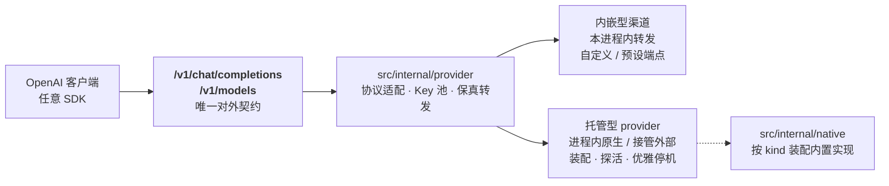

<p align="center">
  
</p>

<h1 align="center">Mergence（模渊）</h1>

<p align="center">
  <b>把多个上游模型服务聚合成一份本地 OpenAI Chat Completions 契约的 Windows 桌面网关</b><br>
  内嵌 WebView2 面板 · 系统托盘 · 渠道管理 · 用量计量 · 协议适配 · 保真转发 · <b>单文件运行 · 纯 MIT</b>
</p>

<p align="center">
  
  
  
  
  
</p>

---

> **Mergence** 是一个 Windows 桌面网关：把多个上游模型服务（含 WorkBuddy / ZCode / Trae 这类
> 账号型网关）聚合成**唯一一份 OpenAI Chat Completions 契约**对外服务，自带面板与系统托盘，
> 单文件运行、**纯 MIT**。

> ⚠️ **仅限自用账号接入个人工具**（本地 SDK / 编辑器 / 脚本）。不支持、也不授权批量注册小号分发额度、
> 二次打包或收费售卖；上游账号的使用边界以各上游平台的服务条款为准。详见 [免责声明](#免责声明)。

## 项目简介

Mergence 把一个 exe 做成「桌面壳 + 本地 HTTP 网关」：对**下**接入任意多家上游，对**上**只暴露一种协议。

- **对外契约只有一份**——OpenAI Chat Completions（`/v1/chat/completions` + `/v1/models`）。
  上游的协议差异（Anthropic Messages、各家中转站）全部在适配层里消化，现有 SDK / 前端 / 工具**零改造接入**。
- **两类渠道**：**内嵌型**（用户直填一个 OpenAI 兼容 `base_url`，本进程内转发）与
  **托管型**（内置 WorkBuddy / ZCode / Trae 实现，在本进程内装配并运行，账号在面板控制台里管）。
- **本地优先**：监听 `127.0.0.1`，数据默认跟 exe 同级（绿色 / 便携），无云端依赖、无外部运行时。

> ⚠️ 本项目是**本地自用网关**，不是公网服务。请勿把面板端口或 `/v1` 出口暴露到公网。

## 核心能力

| 能力 | 说明 |
|---|---|
| 🔌 **唯一对外契约** | `/v1/chat/completions`、`/v1/models`，OpenAI 兼容；`access_key` 鉴权，首次启动自动生成 |
| 🧩 **两类渠道** | 内嵌型（自填端点 + 预设模板）与托管型（内置原生实现），统一在面板里增删改查、启停、连通性测试 |
| 🔑 **账号型网关内置** | WorkBuddy / ZCode / Trae 三个上游**已内置**，无需外部 exe / Python / Node |
| 🖥️ **带页签的控制台** | 积分型平台的账号池、任务、模型档位、积分与用量集中在一个可切换页签的主面板视图里 |
| 🔁 **协议适配与保真转发** | 格式一致时一个字节都不碰；改 JSON 用 `map[string]json.RawMessage`，不破坏大整数与高精度小数 |
| ⚡ **流式 / 非流式** | SSE 逐帧 flush；流式响应同样计量 |
| 📊 **用量与请求计量** | `/api/metrics` 汇总、逐请求日志（含来源 IP / User-Agent / `req_id`） |
| ⏰ **限时套餐定时领取** | 默认关闭；开启后按时间窗口自动领取，也可手动触发 |
| 🔄 **端口热切换** | 面板端口运行中可切换，旧监听优雅关闭 |
| 🪟 **桌面集成** | 托盘驻留、单实例（重复启动唤出已有窗口）、按显示器 DPI 换算窗口尺寸、关窗行为可选 |
| 🧪 **无界面模式** | `-headless` 只跑服务、不建窗口不建托盘（便于脚本与 CI） |

## 架构总览



对外只暴露一种协议；对内的形态差异（内嵌 / 托管、原生 / 接管外部）全部收敛在适配层与编排层。

## 快速开始

### 环境要求

- **Windows 10 / 11**
- **Go 1.25+**（仅构建时需要）
- **WebView2 运行时**（Windows 11 自带；Windows 10 需[单独安装](https://developer.microsoft.com/microsoft-edge/webview2/)）

### 构建

推荐用发布脚本（它会先把 `web/` 同步到 `src/internal/assets/` 再编译，产物落在仓库根）：

```bash
python tools/release/build.py            # 同步 + 编译
python tools/release/build.py --check    # 只校验两份前端是否一致，不编译
python tools/release/build.py --no-build # 只同步，不编译
```

直接调 Go 也可以，但要**自己保证** `src/internal/assets/` 是最新的：

```bash
go build -C src -trimpath -ldflags="-s -w -H windowsgui" -o ../Mergence.exe .
```

### 运行

```bash
Mergence.exe                 # 桌面壳 + 托盘
Mergence.exe -headless       # 只跑服务（等价于 MERGENCE_HEADLESS=1）
```

启动后托盘图标右键 →「打开面板」，或在浏览器里访问启动日志打印的地址（默认 `http://127.0.0.1:1234/`）。

### 验证

在面板「渠道」里添加你的上游，复制 `access_key`，然后：

```bash
curl http://127.0.0.1:1234/v1/chat/completions \
  -H "Authorization: Bearer <面板里复制的 access_key>" \
  -H "Content-Type: application/json" \
  -d '{"model":"<你的模型名>","messages":[{"role":"user","content":"hi"}]}'
```

流式（`curl -N` 观察逐帧输出）：

```bash
curl -N http://127.0.0.1:1234/v1/chat/completions \
  -H "Authorization: Bearer <access_key>" \
  -H "Content-Type: application/json" \
  -d '{"model":"<你的模型名>","messages":[{"role":"user","content":"hi"}],"stream":true}'
```

## 两类渠道

| 类型 | 配置键 | 运行形态 |
|---|---|---|
| **内嵌型** | `embedded_providers` | 跑在网关进程内。自定义 OpenAI 兼容端点，或选用内置预设（见[已并入的 Provider](#已并入的-provider)）。支持多 Key 轮询、权重、模型前缀。 |
| **托管型** | `managed_providers` | 由 Mergence 托管。两种形态：**进程内原生**（默认，内置实现，在本进程内装配并起一个只绑回环的服务）或**外部接管**（渠道环境变量填 `MERGENCE_EXTERNAL_URL=http://…`，接管一个已在运行的外部网关，Mergence 不拉起它）。 |

托管型渠道的管理面板由网关**反向代理**到面板里，`Authorization` 由服务端注入——面板侧不接触上游密钥。

## 积分型平台的控制台与账号入口

积分型平台（`workbuddy` / `zcode` / `trae` 等托管渠道）的账号、任务、模型档位、积分与用量
都在**控制台**里管理。控制台是**一个带页签的主面板视图**：顶部的「平台」下拉 + 页签栏
始终留在原地，切页签只换下面的内容，所以多个渠道用起来像一个控制台，而不是十个长得一样的页面。

### 入口在哪、怎么进

| 入口 | 位置 | 触发方式 |
|---|---|---|
| **侧栏「控制台」分组** | 左侧导航第三个分组 | 展开分组后点渠道卡片下的入口（账号池 / 任务中心 / …）。分组**可收起**，折叠状态会记住；当前视图所在的分组会自动展开 |
| **「积分型平台」页顶部** | 侧栏 → 渠道 → 积分型平台 | 点渠道那一行的「打开控制台」，落在**账号池**（那一页才有「添加账号」） |
| **控制台内的「平台」下拉** | 控制台视图顶部 | 直接换渠道，**页签保留**；新渠道没有这个页签时（如 gateway 的 7 个页签换到 zcode 的 3 个）自动落到它的第一项 |

**添加账号**：进控制台后，集成面板形态（`console_kind=gateway`，如 `workbuddy`）的渠道在
工具条右上角有「添加账号」，账号池页里也有一个同功能的按钮；`zcode` 的账号在它自己的
「账号池」页里加（设备码登录 / 导入 / 领取），因为两者的管理接口完全不同，所以它不显示
工具条上那个按钮。

> ⚠️ **平台「消失」了？** 没有任何账号的托管平台会**整体从「积分型平台」列表里隐藏**，
> 免得空卡片堆满页面。但它的**控制台入口一直都在**（侧栏分组 + 该页顶部会提示
> 「有 N 个平台尚未添加账号」）。所以看到列表是空的时，直接去控制台加账号即可，加完平台自己会回来。

### 入口被隐藏后怎么恢复

「**设置 → 面板显示 → 控制台入口**」控制**「积分型平台」页顶部那块入口区块**的显隐，缺省开启。

- 关掉只是让那一页更清爽：**侧栏「控制台」分组不受影响**，入口永远留着一条可达路径
  （这是刻意的——入口要是能被彻底藏掉，「隐藏」就变成「功能没了」）。
- 恢复方式：回到「**设置 → 面板显示**」，把「控制台入口」重新打开。**改完立即生效，不用重启。**
- 落盘的配置键是 `ui.acct_console`（缺省 `true`），接口是 `POST /api/settings/console`。

### 托管型渠道的字段含义（「添加平台」里那些看不懂的项）

托管型渠道**只有一种运行方式：进程内原生**——Mergence 自己装配内置实现（`workbuddy` /
`zcode` / `trae`），在本进程内起一个只绑 `127.0.0.1:0` 的服务，端口由内核分配。
**没有外部程序要拉起来**，所以没有「启动命令 / 启动参数 / 工作目录 / 端口环境变量 /
固定端口 / 就绪超时」这些字段（早期版本有，已随独立子进程模式一起移除）。

| 字段 | 含义 | 什么时候要管它 |
|---|---|---|
| **渠道类型** | `API 型平台` = 直连 OpenAI 兼容端点；`积分型平台` = 由 Mergence 运行一个网关，账号在控制台里管 | 新建时选一次 |
| **预设模板** | 只是**预填一组字段**的模板，选完每一项仍可改 | 建议先选，省得手抄 |
| **健康检查路径** | 判断「服务起好了没」的 HTTP 路径（如 `/healthz`、`/meta`） | 预设已填好，一般不用改 |
| **数据目录** | 该渠道的账号 / 状态 / 配置落在哪。**留空 = `运行根/data/instances/<渠道名>/data`** | 想把实例数据放到别处时填 |
| **管理 API 前缀** | 上游控制台管理接口的前缀（如 `/panel/api`、`/admin/api`）。Mergence 用它读账号数、代理面板请求 | 预设已填好，一般不用改 |
| **API 前缀** | 该渠道对外暴露的路由前缀，缺省 `/v1` | 需要与其它渠道区分时改 |
| **每积分价值** | 1 积分折合多少元，只用于概览的「积分型费用」估算（如 `0.05`） | 想让花费估算准就填 |
| **环境变量** | 该渠道的 `KEY=VALUE`，一行一个。填 `MERGENCE_EXTERNAL_URL=http://…` 可**接管一个已在运行的外部网关**（Mergence 不拉起它、也不负责停它） | 想让 Mergence 接管你自建的同款网关时填 |
| **注册为可路由渠道** | 关掉 = 只运行、不参与 `/v1` 路由 | 只想用控制台看数据时关掉 |
| **上游 API Key** | 本地 Key（可留空），给该渠道的上游端口加一层鉴权；对 zcode 它**同时是网关后台密码** | 一般留空（zcode 需与网关一致） |

> ⚠️ **账号不随配置迁移**：托管渠道的账号落在它自己的实例数据目录里。换形态（子进程 → 原生）
> 或换机器时，请在新实例里**重新登录**一次；要沿用一套已经部署好、正在运行的外部网关，
> 用「环境变量」里的 `MERGENCE_EXTERNAL_URL` 接管它。

## 已并入的 Provider

预设只是**预填了一组字段的模板**：选中后每一项都能改，保存后就是一个普通渠道，
不参与路由 / 额度 / 日志里的任何特殊分支。

### 托管型预设

三个预设都是**进程内原生**：Mergence 自己装配内置实现，在本进程内起一个只绑 `127.0.0.1`
的服务。**不需要任何外部可执行文件或运行时**，面板与控制台都照常使用。
（早期版本的「独立子进程」形态已移除；要在 Mergence 之外自己跑一个同款网关再让 Mergence 接管，
用渠道「环境变量」里的 `MERGENCE_EXTERNAL_URL`。）

| 预设 | 项目 | 说明 | 许可 |
|---|---|---|---|
| `workbuddy` | **[WorkBuddy 2 API](https://github.com/linguo2625469/workbuddy2api-panel)** | 把 CodeBuddy 账号变成 OpenAI 兼容接口的多账号网关：OAuth 登录、账号池三因子加权轮转、分级熔断与冷却、会话粘性。**已内置**，不需要 `wb2api.exe`。 | MIT |
| `zcode` | **[zcode2api](https://github.com/dengyie/zcode2api)** | ZCode 账号运营 + 双协议网关一体机：账号池轮询、额度监控、限时套餐领取、设备码登录，同时对外提供 Anthropic Messages 与 OpenAI Chat Completions。**已内置**（按实测契约**独立重写**，见下方说明），不需要 Python 环境。 | AGPL-3.0（上游）/ 本项目为独立实现 |
| `trae` | **[trae2api-web](https://github.com/connectedGraph/trae2api-web)** | 把 Trae IDE 的模型能力暴露成本地 OpenAI 兼容端点：账号池调度、冷却状态机、每日签到与设备码 / 回调登录闭环。**已内置**，不需要 `node server.js`；登录回调需要一个固定端口（默认 `18080`，见实例数据目录下的 `config.json`）。 | MIT |

> `workbuddy` 与 `trae` 都是**照搬上游 MIT 源码**内嵌的实现（上游文件头与版权声明逐字保留），
> 许可原文见 [`src/THIRD-PARTY-LICENSES/`](src/THIRD-PARTY-LICENSES/)。
> `zcode` 是**独立重写**：上游 `dengyie/zcode2api`（AGPL-3.0）只作为**契约来源**
> （在其上采样出 HTTP / 落盘 / 出站三类契约），本项目按契约从零实现，
> 仓库里没有任何上游代码，因此 `src/THIRD-PARTY-LICENSES/` 里**没有** zcode 目录。
> 这几个上游项目都是**独立程序，由使用者自行获取与部署**：Mergence **不包含也不分发**它们的二进制，
> AGPL 上游仅以独立进程方式调用、不构成衍生作品。

### 内嵌型预设（进程内转发）

| 预设 | 上游 | 协议 | 默认接入点 | 获取 Key |
|---|---|---|---|---|
| `openrouter` | [OpenRouter](https://openrouter.ai) | OpenAI | `https://openrouter.ai/api/v1` | [keys](https://openrouter.ai/keys) |
| `zhipu` | [智谱 BigModel](https://open.bigmodel.cn) | OpenAI | `https://open.bigmodel.cn/api/paas/v4` | [apikeys](https://open.bigmodel.cn/usercenter/apikeys) |
| `deepseek` | [DeepSeek 官方](https://platform.deepseek.com) | OpenAI | `https://api.deepseek.com/v1` | [api_keys](https://platform.deepseek.com/api_keys) |
| `siliconflow` | [SiliconFlow 硅基流动](https://cloud.siliconflow.cn) | OpenAI | `https://api.siliconflow.cn/v1` | [ak](https://cloud.siliconflow.cn/account/ak) |
| `moonshot` | [Moonshot / Kimi](https://platform.moonshot.cn) | OpenAI | `https://api.moonshot.cn/v1` | [api-keys](https://platform.moonshot.cn/console/api-keys) |
| `anthropic` | [Anthropic（Claude）](https://console.anthropic.com) | **Anthropic Messages** | `https://api.anthropic.com` | [keys](https://console.anthropic.com/settings/keys) |
| `openai` | [OpenAI 官方](https://platform.openai.com) | OpenAI | `https://api.openai.com/v1` | [api-keys](https://platform.openai.com/api-keys) |
| `ollama` | [本地 Ollama](https://ollama.com) | OpenAI | `http://127.0.0.1:11434/v1` | 免 Key |
| `vllm` | 本地 [vLLM](https://github.com/vllm-project/vllm) / [LM Studio](https://lmstudio.ai) | OpenAI | `http://127.0.0.1:8000/v1` | 免 Key |
| `custom` | 任意 OpenAI 兼容端点 | OpenAI | 自填 | — |

上表里只有 `anthropic` 一家协议不同：上游说 Anthropic Messages，由适配层转成 OpenAI 格式对外。
`openai` 的部分新模型只在新版 Responses 协议下可用，需要时可在渠道里改选协议。

托管型渠道的三种来源方式，与许可无关、只取决于上游的获取成本：

- **MIT 上游照搬源码内嵌**（如 `workbuddy`、`trae`）：逐字保留上游文件头与版权声明，许可原文集中放在
  [`src/THIRD-PARTY-LICENSES/`](src/THIRD-PARTY-LICENSES/)，照搬部分不改变本项目自身的 MIT。
- **自己独立重写**（如 `zcode`）：按实测契约从零实现，仓库里不含任何上游代码，可内嵌。
- **AGPL 上游仅进程级调用**（如 `dengyie/zcode2api`，以及你自己部署的 `new-api`）：
  Mergence 只通过 HTTP 边界访问它（可选：用 `MERGENCE_EXTERNAL_URL` 接管一个**已在运行**的实例），
  **不包含也不分发**其二进制，也不代其上游服务授予任何权利，不构成衍生作品；
  各项目自身的免责声明同样适用。

## 目录结构

根目录只有 exe 本体与按职责分开的文件夹——一个文件夹只放一类东西：

```
mergence/
├─ Mergence.exe          构建产物（go build 生成，唯一散落在根的文件）
├─ README.md             ← 你正在读的
├─ LICENSE
├─ .gitignore
│
├─ web/                  面板前端资源（唯一真源：HTML / JS / CSS）
├─ config/               用户配置（mergence.json，首次启动自动生成）
├─ data/                 运行期数据（logs/ usage/ cache/ instances/）
│
├─ src/                  Go 源码
│  ├─ main.go            启动顺序：配置 → 日志 → 单实例 → 端口 → 编排 → 服务 → 窗口 / 托盘
│  ├─ go.mod / go.sum
│  ├─ app.ico           图标母版（6 档 BMP 编码；构建不消费它，见「图标资源」）
│  ├─ appres.syso       PE 资源：图标组 + DPI 清单 + 版本信息（单 .rsrc 段）
│  ├─ winres/           go-winres 输入：winres.json + icon{16..256}.png
│  └─ internal/
│     ├─ config/         配置读写与归一化（未知协议明确报错，不猜默认值）
│     ├─ logging/        结构化日志：内存环 + 滚动文件
│     ├─ orchestrator/   托管型 provider 的实例生命周期（装配 / 探活 / 优雅停机）
│     ├─ provider/       内嵌型渠道：路由、协议适配、Key 池、连接测试
│     │  ├─ workbuddy/   内置原生实现（MIT 上游照搬内嵌）
│     │  ├─ trae/        内置原生实现（MIT 上游照搬内嵌）
│     │  └─ zcode/       内置原生实现（按契约**独立重写**，无上游代码）
│     ├─ native/         进程内原生装配层：按 kind 把上面的实现装进本进程
│     ├─ metrics/        用量计量与定价
│     ├─ claim/          限时套餐的定时领取
│     ├─ desktop/        WebView2 壳、托盘、单实例、有序退出
│     ├─ assets/         前端资源的**构建镜像**（由 web/ 同步而来，不要手改）
│     └─ web/            内置 HTTP 服务：对外 /v1 出口 + 对内 /api 控制面
│
├─ test/                 端到端验证脚本（假上游 + CDP 驱动真实界面）
│  └─ shot_tools/        界面截图（给人看的，不含断言）
├─ tools/                开发与发布期脚本
│  ├─ release/           构建、全量快照、公开副本导出、提交前泄露扫描
│  ├─ icon/              图标生成与 PE 资源核对（见「图标资源」一节）
│  └─ win/               桌面集成：快捷方式生成（mkshortcut）、窗口截图
└─ docs/                 设计与改造记录
```

### 前端资源为什么有两份

`go:embed` **不允许 `..`**，而面板资源要放进 `internal/assets` 这个包才能被内嵌——
所以「根目录的 `web/`」和「`src/internal/assets/`」在物理上必须是两处。约定：

- **`web/` 是唯一真源**，改前端只改这里。
- `src/internal/assets/` 是**构建镜像**，由 `tools/release/build.py` 在编译前用 sha256 逐文件同步，不手工改。
- 运行时**优先读 exe 同级的 `web/`**（便于热改调试），读不到才回落到 exe 内嵌副本。
  也就是说：删掉 `web/` 应用照常工作，只是前端不能外置调整。

## 运行与配置

**数据目录默认跟 exe 同级**，也就是「绿色 / 便携」形态：把整个文件夹拷到哪，配置和数据就跟到哪。

```
mergence/
├─ Mergence.exe
├─ config/
│  └─ mergence.json      配置（access_key 首次启动自动生成）
├─ data/
│  ├─ logs/              结构化日志
│  ├─ usage/             用量计量累积
│  ├─ cache/             WebView2 用户数据目录
│  └─ instances/         托管型 provider 的实例数据
└─ web/                  （可选）外置前端，见上文「前端资源为什么有两份」
```

查找顺序（第一个成立者胜出）：

1. 环境变量 `MERGENCE_HOME`（显式指定，最高优先级）
2. **exe 所在目录**——但必须**实测可写**（会在该目录建临时文件再删掉验证），
   避免 exe 放在 `Program Files`、只读介质或受控文件夹访问拦截时静默失败
3. `%LOCALAPPDATA%\Mergence`（回落，Windows 上的常规选择）
4. 系统临时目录下的 `Mergence`（最后的兜底）

`config/` 与 `data/` 缺失时会在启动时自动创建，不需要手工准备。

面板监听在 `127.0.0.1`，端口默认动态分配；可在面板「设置」里固定为指定端口（如 `1234`）。
实际地址以启动日志为准。

### 配置与登录态各存在哪

**登录态的位置**（备份与换机时最容易搞错的一点）：托管渠道**一律进程内原生**，
账号、状态、配置都落在它自己的实例数据目录里。

| 位置 | 放什么 | 删了会怎样 |
|---|---|---|
| `config/mergence.json` | 渠道（含 `kind` / `mode` / route key / 数据目录）、端口、`access_key`、`claim.admin_key`、界面偏好 | **要重新配置** |
| `data/instances/<渠道名>/data/` | 托管渠道的数据：`auths/`（账号）、`state.json`、`config.json`；zcode 为 `accounts.db` | **丢账号** |
| `data/usage/`、`data/logs/` | 用量计量、日志 | 只丢历史，可再生 |
| `data/cache/` | 面板窗口的用户数据（含界面偏好，如主题、分组与页签记忆） | 只丢界面偏好 |

- ⇒ **备份 / 换机口径：`config/` + `data/instances/` 一起带走**，少一处就丢账号。
- 早期版本由 Mergence 拉起独立子进程（`mode=process`）时，数据在上游自己的 `dir` 下
  （如 `wb2api` 的 `auths/`、`zcode2api` 的 `data/accounts.db`）。该形态**已移除**，
  那批账号不会自动出现在原生实例里，需要**重新登录**（或把那套外部网关跑起来再用
  `MERGENCE_EXTERNAL_URL` 接管）。

### 从 ModelMux 升级：旧配置会被自动继承

项目更名时配置文件名也跟着变了（`modelmux.json` → `mergence.json`）。**启动时如果 `mergence.json`
不存在、而同目录下有 `modelmux.json`，会自动把它迁移过来**——否则老用户一升级就等于
「账号与渠道全部消失」，而且没有任何报错，只表现为界面空空如也。迁移细节：

- 迁移是**拷贝**，旧文件原样保留（想回退旧版本随时可用），并会在日志里留一条
  `已从旧版配置 modelmux.json 迁移渠道与设置`。
- 两个文件都在时**以 `mergence.json` 为准**，不会被旧文件覆盖回去。
- 非便携安装（回落 `%LOCALAPPDATA%`）同理：新目录 `%LOCALAPPDATA%\Mergence` 还不存在、
  而旧目录 `%LOCALAPPDATA%\ModelMux` 存在时，继续沿用旧目录。

## 对外接口

| 路径 | 说明 |
|---|---|
| `/` | 面板（优先读 exe 同级 `web/`，读不到用 exe 内嵌副本） |
| `/v1/chat/completions`、`/v1/models` | OpenAI 兼容出口，需 `access_key` |
| `/api/status`、`/api/healthz`、`/api/logs` | 状态与日志 |
| `/api/channels*` | 渠道管理（增删改查 / 启停 / 测试 / 拉模型） |
| `/api/channels/{name}/upstream/{path...}` | 托管型渠道的管理面板反代 |
| `/api/metrics` | 用量与请求计量 |
| `/api/claim*` | 限时套餐领取 |
| `/api/settings/port`、`/api/settings/close`、`/api/settings/console` | 端口 / 关窗行为 / 面板显示偏好 |
| `/api/quit` | 有序退出 |

## 设计约束

这三条是硬约束，改动时不能破：

1. **对外契约只有一份**——OpenAI Chat Completions。任何上游的协议差异都在 `src/internal/provider`
   的适配层吸收，不对外暴露第二套格式。
2. **工作方式分两类，都不引入第三方许可负担**。
   - **照搬 MIT 上游源码**（`workbuddy` / `trae`）：须保留其版权声明，许可原文集中放在
     `src/THIRD-PARTY-LICENSES/`；照搬来的那部分不改变本项目自身的 MIT。
   - **独立重写**（`zcode`）：上游 `dengyie/zcode2api` 是 AGPL-3.0，**不能照搬**，
     因此按实测契约**从零重写**成 Go（`src/internal/provider/zcode/`）。
     本仓库里没有任何上游代码，所以也不需要它的许可原文。

   两种方式都**不是**上游 AGPL 代码，因此都可内嵌且不改变 Mergence 的 MIT。
   AGPL 上游（如 `new-api`、`dengyie/zcode2api`）一律只做**进程级**调用
   （外部进程 / 网络边界），不构成衍生作品。
3. **不随包分发第三方二进制**。托管型 provider 由用户自行获取，本项目不分发。

配套的工程约定：

| 约定 | 原因 |
|---|---|
| 未实现的协议**明确报错并附原因**，不回落近似协议「试一下」 | 静默回落会把上游的报错变成用户看不懂的谜题 |
| 上游错误**原样透传**（状态码 + 错误体） | 客户端要靠状态码决定重试策略 |
| 转发**保真优先**：格式一致时一个字节都不碰 | 改 JSON 用 `map[string]json.RawMessage`，`map[string]any` 经 `float64` 往返会破坏大整数与高精度小数 |
| **区分「字段缺失」与「空值」** | Go 里 `nil` slice = 字段缺失，空数组 = 显式清空 |
| 会导致路由歧义的配置**禁止 + 报错**，不猜默认值 | 猜错会把请求静默送到错误的上游 |

## 构建细节（图标资源）

`-H windowsgui` 必须有，否则会多出一个黑色控制台窗口。

`src/appres.syso` 已随仓库提供，`go build` 会自动拾取（同目录的 `*.syso` 会被自动收集）。
它由 **go-winres** 按 `src/winres/winres.json` 生成，一个 `.rsrc` 段里同时装三样东西：
`RT_GROUP_ICON`（6 档图标）+ `RT_MANIFEST`（DPI `permonitorv2` 清单）+ `RT_VERSION`（版本信息）。
**不要用 `akavel/rsrc -ico app.ico` 去重建**——它只能出图标组，会**静默丢掉 DPI 清单与版本信息**。
需要重建时：

```bash
cd src && go run github.com/tc-hib/go-winres@latest make \
  --in winres/winres.json --out appres.syso --no-suffix --arch amd64
```

重建后核对资源类型（应看到 6 个 `RT_ICON` + `RT_GROUP_ICON` + `RT_VERSION` + `RT_MANIFEST`，
且 `.rsrc` 只有一段）：

```bash
python tools/icon/pe_resources.py Mergence.exe
```

关于两个图标文件的分工：

- **构建真正吃的是** `src/winres/winres.json` + `src/winres/icon{16,32,48,64,128,256}.png`。
- `src/app.ico`（BMP 编码、同 6 档）是这批 PNG 的**母版**，`go build` **不消费它**。
  它是 `tools/icon/build_mergence_icon.py` 从一张 1440×1440 的 PNG logo 生成的，
  而那张源图**不在仓库里** ⇒ `app.ico` 目前不能在仓库内复现，请勿随手删除。

## 端到端验证

`test/` 下是**真实运行的**验证脚本（需要 Python 3）：用假上游覆盖协议分支，用 CDP 驱动真实界面点击。

```bash
python test/verify.py              # 全链路：托管型 provider 全生命周期、端口热切换
python test/verify_upstream_ui.py  # 上游控制台逐视图
python test/verify_side_console.py # 侧栏渠道卡与常驻控制台入口
python test/verify_layout_ui.py    # 侧栏 / 概览拆分 / 渠道嵌套编辑
python test/verify_pick_ui.py      # 拉取模型全选与结果弹窗
python test/verify_theme.py        # 首帧主题（防亮暗闪烁）
python test/verify_claim.py        # 限时套餐定时领取链路
python test/verify_zcode_accounts.py  # zcode 账号面板（外部接管假网关）
python test/verify_zcode_native.py    # zcode 内置原生（Mergence 自己装配，无外部进程）
python test/gui_check.py           # 托盘与窗口生命周期
python test/check_sources.py       # 源码级不变式（内联 style、通知 API 是否被重新引入）
python test/verify_silent_minimize.py  # 最小化 / 隐藏不得产生系统通知
python test/verify_proxy_real.py   # 真实 wb2api 账号管理代理（用你的真实配置）
```

跑之前先看清楚：

| 脚本 | 前置条件 |
|---|---|
| `verify.py` / `verify_claim.py` / `verify_pick_ui.py` / `gui_check.py` / `verify_zcode_native.py` / `verify_zcode_accounts.py` | 使用隔离的 `MERGENCE_HOME`，**不会动你的真实配置** |
| `verify_layout_ui.py` / `verify_side_console.py` / `verify_upstream_ui.py` / `verify_theme.py` | 需要**本机已有一个实例在跑**（`BASE` 硬编码 `http://127.0.0.1:1234/`，脚本自己不起实例） |
| `gui_check.py` | 需要**独占同一安装目录**：单实例互斥体按 exe 目录派生，同目录已有实例会被唤出并退出。想与在跑的实例共存，把 exe 复制到另一个目录再跑 |
| `verify_workbuddy.py` | ⚠️ 会**写你的真实配置**，慎跑 |
| `verify_proxy_real.py` | ⚠️ 用你的**真实配置**启动；需要本机真有一个可用的 WorkBuddy 渠道（现为进程内原生） |
| `verify_silent_minimize.py` | 需要**本机已有一个实例在跑**，并且**会真的最小化 / 隐藏它的窗口**。多实例机器上务必用 `MERGENCE_PID=<pid>` 锁定目标，否则可能操作用户正在用的窗口 |
| `check_sources.py` | 不需要实例，纯源码检查 |

`test/shot_tools/` 下是**截图工具**（`shots.py`、`shots_desktop.py`、`panel_shot.py`、`shot_settings.py`），
只产出给人看的 PNG、不含任何断言，所以不在上面的验证清单里。

## 维护脚本

```bash
python tools/release/build.py               # 构建：同步 web/ → src/internal/assets/，再编出根目录的 Mergence.exe
python tools/release/backup_project.py      # 全量快照（源码 + 配置 + 编译产物），默认输出到仓库同级的 _backups/
python tools/release/export_for_github.py   # 导出可公开的干净副本（白名单式）
python tools/release/scan_secrets.py        # 提交前的泄露扫描
```

`export_for_github.py` 是**白名单式**的：只列进清单的文件才会出去（`src/` `web/` `docs/` `tools/` `test/`
与 `README.md` `LICENSE` `.gitignore`），因此新增文件时不会不小心把含真实密钥的 `config/`
或运行期 `data/` 带进公开仓库。含真实账号 token 的 `_ref/` 与历史快照已移出仓库，
`.gitignore` 里的规则保留作兜底。目标目录已存在时默认中止，确认要同步进已有仓库时加
`GITHUB_EXPORT_INTO=1`——该模式下只覆盖同名文件、不动 `.git`，但会**清掉「源里已删除、
目标里还留着」的文件**（否则从白名单撤下的文件会永久留在公开仓库里），要保留它们设
`GITHUB_EXPORT_NO_PRUNE=1`。

三个脚本的路径都自动推导，也可用 `MERGENCE_SRC` / `BACKUP_DIR` / `GITHUB_EXPORT_DIR` / `GO` 覆盖。

## 第三方与许可

Go 依赖：

| 模块 | 许可 |
|---|---|
| `github.com/jchv/go-webview2` | MIT |
| `github.com/jchv/go-winloader` | ISC |
| `golang.org/x/sys` | BSD-3-Clause |

**托管型 provider 与面板里出现的上游服务**分两类：MIT 上游照搬源码内嵌（`workbuddy`、`trae`，
版权声明逐字保留），其余是独立程序、由使用者自行获取，本项目**不包含也不分发**其二进制。
各项目的链接、许可与说明见[已并入的 Provider](#已并入的-provider)；
照搬部分的许可原文见 [`src/THIRD-PARTY-LICENSES/`](src/THIRD-PARTY-LICENSES/)，
其余项目的许可与使用合规性由各自项目及使用者自行负责。

## 常见问题

### 升级后渠道不见了，面板上一片空白？

托管渠道的旧形态（`mode: "process"`，独立子进程）已**整体移除**。老配置里的 `process` /
空 `mode` 会被**明确禁用并告警**（不会静默按原生跑起来把账号目录换掉）。请在面板里把渠道
删掉重新添加一次（选 `积分型平台` + 对应预设），账号在新实例里**重新登录**。

### 平台在「积分型平台」里消失了？

没有任何账号的托管平台会整体隐藏。去**控制台**（侧栏分组或该页顶部入口）加账号，加完自动回来。
详见[积分型平台的控制台与账号入口](#积分型平台的控制台与账号入口)。

### 端口每次都变，能固定吗？

默认动态分配。在「设置」里固定为指定端口（如 `1234`）即可，运行中热切换、旧监听优雅关闭。

### 换机器 / 备份要带哪些？

**`config/` + `data/instances/`** 一起带走，少一处就丢账号。详见
[配置与登录态各存在哪](#配置与登录态各存在哪)。

### 面板打不开或内容区全白？

在**无独显 / 虚拟显示 / 受限会话**的机器上，WebView2 可能因 GPU 合成失败而白屏（不报错）。
此时给环境变量加 `WEBVIEW2_ADDITIONAL_BROWSER_ARGUMENTS=--no-sandbox --disable-gpu` 再启动
（**仅 `--disable-gpu` 无效**）。`MERGENCE_HEADLESS=1` 也可绕过窗口直接用浏览器访问面板。

### 改前端后界面没变？

前端必须物理两处（`web/` 与 `src/internal/assets/`），只跑 `go build` 会编到旧副本。
改前端后请跑 `python tools/release/build.py`（它会先同步再编译）。

## 免责声明

- 本项目是**本地自用网关**，按「原样」提供，不附带任何明示或暗示的担保。使用者需自行承担
  使用风险，包括但不限于上游账号被限流、封禁、条款违约等后果。
- 本项目**不授权、不支持、不参与**任何面向公众的 API 售卖、账号池出租、卡密 / 授权码收费分发，
  也不支持批量注册小号分发额度。以本项目名义的收费分发与本项目及作者无关。
- 本项目**不包含也不分发**任何上游程序的二进制。托管型上游由使用者自行获取与部署，
  其许可与合规性由各自项目及使用者负责；AGPL 上游仅以**进程级**方式调用，不构成衍生作品。
- 请勿把面板端口或 `/v1` 出口暴露到公网。

## License

MIT，见 [LICENSE](LICENSE)。
